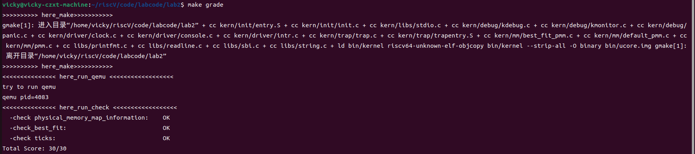

<h1 align="center" style="border: none;"><strong>lab2：物理内存和页表</strong></h1>
<h2 align="center" style="border: none;">涂佳欢语2213235 王婷睿2210578 胡可玉2212913</h2>


## 一、实验目的

在lab1中我们做出了一个可以启动的系统，在本次实验中我们将学习如何管理操作系统的物理内存管理，并且建立一个最简单的页表映射。

实验目的如下
- 理解页表的建立和使用方法
- 理解物理内存的管理方法
- 理解页面分配算法

***

## 二、实验过程

在实验开始之前仔细阅读了实验指导手册，在理解了分页机制、物理内存管理等知识点后开始进行实验操作。

***

### 2.1、练习0：根据lab1补全lab2相关代码

在lab2.md中指出，开始实验前首先将lab1中中断相关代码补全到lab2中，因此将lab1中设置计数至10次100次中断时调用关机函数关机的操作迁移到lab2的代码中。在这里由于sbi.c文件中并没有sbi_shutdown()函数的定义，因此我们需要迁移代码，作为前提条件。

在此步完成后可以实现lab1的操作。

***

### 2.2、练习1：理解first-fit 连续物理内存分配算法

first-fit连续物理内存分配算法是物理内存分配中一个基础方法。其核心思想是保持一个空闲块列表，在接收到内存请求时，扫描空闲块列表，找到第一个足够大的块来满足请求。当找到的块明显大于所请求的大小时，该块通常会被分割，剩余的部分会被返回到空闲块列表中。

本次实验中该算法主要实现在pmm.c文件中。为了更加深刻的理解整个物理内存分配的过程，我们从最初内核初始化时查看物理内存相关代码。

在 **kern_init()** 函数中，添加代码pmm_init()接口，来初始化物理内存管理，我们在pmm.c文件中进行了初始化操作，包括init_pmm_manager()、page_init()、check_alloc_page()等，来进行物理内存管理器的初始化，页面的初始化等。

在pmm.h和memlayout.h文件中分别定义了两个结构体：pmm_manager（物理内存管理器接口）和Page(页)。

```c++
struct pmm_manager {//定义了物理内存管理器的接口
    const char *name;  
    void (*init)(
        void);  
    void (*init_memmap)(
        struct Page *base,
        size_t n);  
    struct Page *(*alloc_pages)(
        size_t n);  
    void (*free_pages)(struct Page *base, size_t n);  /
    size_t (*nr_free_pages)(void); 
    void (*check)(void);            
};
```
```c++
struct Page {
    int ref;                      
    uint64_t flags;               
    unsigned int property;          
    list_entry_t page_link;        
};
```
我们可以发现在pmm_manager结构体定义了物理内存管理器的接口;包含了物理内存初始化、分配、释放等的指针，和名字属性，为后续进行不同的物理内存管理方法的操作提供了便捷。

在这里为了明白pmm_manager接口和具体的实例是如何结合的，我们以best-fit方法中的结构体best_fit_pmm_manager的定义为例，进行理解：
```c++
const struct pmm_manager best_fit_pmm_manager = {
    .name = "best_fit_pmm_manager",
    .init = best_fit_init,
    .init_memmap = best_fit_init_memmap,
    .alloc_pages = best_fit_alloc_pages,
    .free_pages = best_fit_free_pages,
    .nr_free_pages = best_fit_nr_free_pages,
    .check = best_fit_check,
};
```
其中best_fit_pmm_manager 是best-fit的具体的物理内存管理器的实例，其提供了具体的内存管理实现。pmm_manager best_fit_pmm_manager这种书写格式即将结构体定义和实例化结合在一起，以便于组织和使用相关数据。

在init_pmm_manager()函数中通过设置pmm_manger的类型来确定使用了哪一个物理内存初始化的方法，从而进行初始化。
```c++
static void init_pmm_manager(void) {
    pmm_manager = &best_fit_pmm_manager;
    cprintf("memory management: %s\n", pmm_manager->name);
    pmm_manager->init();
}
```
后续如内存分配释放等操作也是类似上述操作。


接下来我们查看具体的first-fit连续内存分配方法，其主要位于default_pmm.c文件中。
在default_pmm.c文件中首先定义了default_pmm_manager，在这个结构体里面调用了default_pmm_manager（使用first-fit物理内存分配方法的对象）初始化的函数。 
```c++
const struct pmm_manager default_pmm_manager = {
    .name = "default_pmm_manager",
    .init = default_init,
    .init_memmap = default_init_memmap,
    .alloc_pages = default_alloc_pages,
    .free_pages = default_free_pages,
    .nr_free_pages = default_nr_free_pages,
    .check = default_check,
};
```

```c++
static free_area_t free_area;
#define free_list (free_area.free_list)
#define nr_free (free_area.nr_free)
```
这行代码定义了一个静态变量 `free_area`，它的类型是 `free_area_t`。`free_area_t` 结构体通常用于管理空闲内存块，包含一个空闲列表和一个用于记录空闲块数量的字段。`static` 关键字表示该变量只在当前文件范围内可见，其他文件无法访问。下面两行宏定义将 `free_area` 结构体中的 `free_list` 和 `nr_free` 字段分别简化为 `free_list` 和 `nr_free`，方便代码中使用。这种方式减少了重复引用结构体字段的代码长度，使代码更简洁。

default_init()
```c++
static void
default_init(void) {
    list_init(&free_list);
    nr_free = 0;
}
```
在函数中初始化空闲链表，并且使空闲页总数初始化为0。

default_init_memmap

```c++
static void  //为一段连续的内存页设置初始状态，并将它们加入空闲页列表  
default_init_memmap(struct Page *base, size_t n) {  //内存页的起始指针 base 和一个大小 n
    assert(n > 0);//使用assert宏，确保传入的n是大于 0 的。如果 n <= 0，程序将会中止执行。此检查用于防止无效的内存块初始化请求。
    struct Page *p = base;
    for (; p != base + n; p ++) {//遍历从 base 到 base + n 的每个内存页
        assert(PageReserved(p));
        p->flags = p->property = 0;
        set_page_ref(p, 0);
    }
    base->property = n;//其之后(包括自己)有多少个空闲页
    SetPageProperty(base);
    nr_free += n;//记录空闲物理页个数

    if (list_empty(&free_list)) {
        list_add(&free_list, &(base->page_link));
    } else {
        list_entry_t* le = &free_list;
        while ((le = list_next(le)) != &free_list) {
            struct Page* page = le2page(le, page_link);
            if (base < page) {//base 页的地址小于当前页的地址，说明应该在当前页之前插入
                list_add_before(le, &(base->page_link));
                break;
            } else if (list_next(le) == &free_list) {
                list_add(le, &(base->page_link));
            }
        }
    }
}
```
在该段代码中我们实现了内存初始化和空闲页链表管理逻辑，首先我们遍历内存页并且重置这些页的标志、属性和引用计数。设置连续内存页的起始页地址，增加空闲物理页数。
当空闲页表是空时，直接把起始base加入链表中，如果空闲链表不为空，则遍历空闲链表，找到合适的位置加入。

default__alloc_pages

```c++
static struct Page *
default_alloc_pages(size_t n) {//分配内存页  根据请求的页数 n 分配空闲的内存页
    assert(n > 0);
    if (n > nr_free) {
        return NULL;
    }
    struct Page *page = NULL;
    list_entry_t *le = &free_list;
    while ((le = list_next(le)) != &free_list) {
        struct Page *p = le2page(le, page_link);
        if (p->property >= n) {
            page = p;
            break;
        }
    }
    //从空闲页中分配指定数量的页，同时处理了可能的页分割情况，以确保系统内存管理的有效性
    if (page != NULL) {
        list_entry_t* prev = list_prev(&(page->page_link));
        list_del(&(page->page_link));
        if (page->property > n) {
            struct Page *p = page + n;
            p->property = page->property - n;
            SetPageProperty(p);
            list_add(prev, &(p->page_link));
        }
        nr_free -= n;
        ClearPageProperty(page);
    }
    return page;
}
```
这段代码用于对空闲物理内存页的分配。
首先，当请求的页数大于空闲页的数目，则返回空值；否则正常进行分配。
在这里我们定义一个指向空闲页链表表头的指针le，遍历链表，查找第一个 property 大于或等于 n 的页面，如果找到了符合条件的页面，则将其指针赋值给 page 并跳出循环。
之后进行页面的分割。寻找当前空闲页节点的前一节点prev，当当前节点的property大于请求的个数时，寻找当前节点使用n个页面后的第一个页面节点p，将prev和p连接起来，用于空闲链表的删除和连接。同时，我们设置了p的属性。

default_free_pages()

```c++
static void
default_free_pages(struct Page *base, size_t n) {//释放已分配的内存页的功能  将一段连续的内存页标记为可用，并将其添加回空闲页列表。
    assert(n > 0);
    struct Page *p = base;
    for (; p != base + n; p ++) {
        assert(!PageReserved(p) && !PageProperty(p));//确保当前页没有被预留且没有设置属性，表示它是可用的
        p->flags = 0;
        set_page_ref(p, 0);
    }
    base->property = n;
    SetPageProperty(base);
    nr_free += n;

    if (list_empty(&free_list)) {
        list_add(&free_list, &(base->page_link));
    } else {
        list_entry_t* le = &free_list;
        while ((le = list_next(le)) != &free_list) {
            struct Page* page = le2page(le, page_link);
            if (base < page) {
                list_add_before(le, &(base->page_link));
                break;//
            } else if (list_next(le) == &free_list) {
                list_add(le, &(base->page_link));
            }
        }
    }


    list_entry_t* le = list_prev(&(base->page_link));
    if (le != &free_list) {
        p = le2page(le, page_link);
        if (p + p->property == base) {//before
        //p + p->property 的计算实际上是将指针 p 移动到该页管理的最后一个页的地址。根据 C 语言的指针运算，p + n 表示向后移动 n 个页的大小。
            p->property += base->property;
            ClearPageProperty(base);
            list_del(&(base->page_link));
            base = p;
        }
    }

    le = list_next(&(base->page_link));
    if (le != &free_list) {
        p = le2page(le, page_link);
        if (base + base->property == p) {//after
            base->property += p->property;
            ClearPageProperty(p);
            list_del(&(p->page_link));
        }
    }
}
```
这一段代码用于释放已分配的物理内存页，并将其标记为可用状态，同时将其添加回空闲页列表，并且进行相邻物理页面的合并。
首先，我们将将要释放的物理内存进行属性的重置，并且和初始化时一样将其添加回空闲链表。在这里我们进行空闲链表相邻物理页块的合并。
当前一个节点的末尾与当前释放块的开始相邻，则将其合并，更新 property 并清除当前块的属性 ; 当当前块的末尾与下一个块的开始相邻，同样进行合并，更新属性并从链表中删除下一个块。
***

在first-fit方法中，我们发现寻找最先适配大小的物理页块存在浪费空间的情况，因此，进行小改进，选择使用best-fit方法来减轻这种情况。后续还将尝试buddy system（伙伴系统）分配算法和任意大小的内存单元slub分配算法。

***

### 2.3、练习2：实现 Best-Fit 连续物理内存分配算法
Best-Fit 连续物理内存分配算法和first-fit连续物理内存分配算法相比，主要差别在best-fit算法在系统需要分配内存时，从所有空闲块中寻找大小最接近需求的块，确保尽量减少内存浪费。
因此我们在best_fit_pmm.c文件中进行代码补全。
从上述描述中我们可以知道best_fit方法的主要改进逻辑点，因此我们可以知道其与first-fit方法代码的不同点应该就是关于分配物理内存时寻找物理内存块的操作，因此我们只需要修改best_fit_alloc_pages()函数即可。

best_fit_alloc_pages（）

```c++
static struct Page *
best_fit_alloc_pages(size_t n) {
    assert(n > 0);
    if (n > nr_free) {
        return NULL;
    }
    struct Page *page = NULL;
    list_entry_t *le = &free_list;
    size_t min_size = nr_free + 1;
     /*LAB2 EXERCISE 2: YOUR CODE*/ 
    // 下面的代码是first-fit的部分代码，请修改下面的代码改为best-fit
    // 遍历空闲链表，查找满足需求的空闲页框
    // 如果找到满足需求的页面，记录该页面以及当前找到的最小连续空闲页框数量
    while ((le = list_next(le)) != &free_list) {
        struct Page *p = le2page(le, page_link);
        if (p->property >= n) {
            if(p->property<min_size){//find the minest one
               page = p;
               min_size = p->property;
            }
            //page = p;
            //break;
        }
    }

    if (page != NULL) {// cut
        list_entry_t* prev = list_prev(&(page->page_link));
        list_del(&(page->page_link));
        if (page->property > n) {
            struct Page *p = page + n;
            p->property = page->property - n;
            SetPageProperty(p);
            list_add(prev, &(p->page_link));
        }
        nr_free -= n;
        ClearPageProperty(page);
    }
    return page;
}
```
在这个代码里面，我们从空闲块链表中找到大小大于等于所需页面数的最小空闲块。找到合适的块后，从该块中分配出请求数量的物理页面并将其从空闲链表中移除。接着，将剩余部分重新切割，并将切割后的第一个物理页与之前的空闲块相连，以维护链表的完整性和连续性。最后我们需要更新空闲页表数目，清空删除页的属性等。
因此在这个代码中我们设置一个min_size（初始值为当前空闲页表数+1），作为在这个空闲链表中我们搜寻到的满足条件的最小property值。在需要补全的部分中我们遍历整个空闲链表，当寻找到满足条件（即page->property > n）时，我们需要将其与min_size做比较，当其小于min_size时，我们更新min_size的值，否则则继续循环，直到到达链表末尾。这样我们就能够寻找到最小的满足条件的物理页块。

其余代码与练习1相同，在这里不再叙述，可查看我们github仓库代码。

***

make grade结果如下：
 

### 2.4、练习3：buddy system（伙伴系统）分配算法
根据指导手册给出的网址以及网上搜索的一些资料，buddy_system通过将内存划分为不同大小的块，且每个块的大小都是2的幂。在本次实验中采用一个新的数据结构buddy2并采用二叉树来实现。
1.创建和初始化buddy2
```c++
//创建数据结构
typedef struct buddy2 {
    unsigned size;
    unsigned *longest;  // 用于管理树的数组
} buddy2_t;

// 初始化 buddy2 系统
static buddy2_t *buddy2_new(unsigned size) {   
    unsigned node_size;

    if (size < 1 || !IS_POWER_OF_2(size)) {
        return NULL;  // size 必须是 2 的幂
    }

    buddy.size = size;
    node_size = size * 2;

    for (unsigned i = 0; i < 2 * size - 1; i++) {
        if (IS_POWER_OF_2(i+1)) {
            node_size /= 2;
        }
        buddy.longest[i] = node_size;
    }

    return &buddy;
}
```c++

2.利用buddy2来分配页。如果一个进程来请求分配内存，会先判断是不是2次幂，如果不是就会找到其最近的2次幂。从根节点开始找合适的块，如果块大于所需要的大小，就划分为所需要的大小。
```c++
static struct Page *
buddy_system_alloc_pages(size_t n) {
    assert(n > 0);
    unsigned offset = 0;

    if (n > nr_free) {
        return NULL;
    }

    unsigned current_size = IS_POWER_OF_2(n) ? n : fixsize(n);

    // 在 buddy system 中查找合适的块
    unsigned index = 0;
    unsigned node_size;
    for (node_size = buddy.size; node_size != current_size; node_size /= 2) {
        if (buddy.longest[2 * index + 1] >= current_size) {
            index = 2 * index + 1;
        } else {
            index = 2 * index + 2;
        }
    }
    if (buddy.longest[index] < n) {
        return NULL;
    }
    buddy.longest[index]=0;
    //从该节点往上修改相关的节点
    while(index>0){
        if(index%2==0){
            index = (index - 2) / 2;
        }
        else{
            index = (index - 1) / 2;
        }
        buddy.longest[index]=(buddy.longest[2 * index + 1] > buddy.longest[2 * index + 2]) ? buddy.longest[2 * index + 1] : buddy.longest[2 * index + 2];
    }


    // 找到合适的块，从链表中移除相应的页面
    offset = (index + 1) * node_size - buddy.size;
    struct Page *page = current_base+offset;
    page->property=0;

    unsigned page_size =fixsize(n);
    nr_free -= page_size;

    for(struct Page* i=page;i!=page+page_size;i++){
        ClearPageProperty(i);
    }

    return page;
}
```c++

3.当释放一个内存块时，系统会检查其伙伴块是否也空闲。如果是，两个伙伴块将合并成一个更大的块。这种合并过程可以重复进行，直到无法再合并。
```c++
static void 
buddy_system_free_pages(struct Page *base, size_t n) {
    assert(n > 0);

    // 重置页面的 flags
    unsigned size = IS_POWER_OF_2(n) ? n : fixsize(n);
    struct Page *p = base;
    for (; p != base + n; p++) {
        assert(!PageReserved(p) && !PageProperty(p));
        p->flags = 0;
        set_page_ref(p, 0);
    }
    base->property = n;

    // 确定起始节点的位置
    unsigned offset = base - current_base;
    unsigned index = offset + buddy.size - 1;
    buddy.longest[index] = size;
    nr_free += size;

    //将该节点上面的节点加上释放的内存
    while(index>0){
        // 找到父节点位置
        index = (index - 1) / 2;  

        // 获取左子节点和右子节点的大小
        unsigned left_size = buddy.longest[2 * index + 1];
        unsigned right_size = buddy.longest[2 * index + 2];

        // 如果左、右子节点都空闲且大小相等，则合并为更大的块
        int order =0;
        while(index >>= 1){
            order++;
        }
        unsigned temp_size=1048576;
        for (unsigned i = 0; i < 2 * order - 1; i++) {
            if (IS_POWER_OF_2(i+1)) {
                temp_size /= 2;
            }
        }
        if (left_size == right_size && left_size == temp_size) {
            buddy.longest[index] = left_size * 2;
        } else {
            buddy.longest[index] = left_size>right_size?left_size:right_size;
        }
    }

     // 清除页面的属性
    for (struct Page *i = p; i != p + size; i++) {
        ClearPageProperty(i);
    }
}
```c++


### 2.5、练习4：任意大小的内存单元slub分配算法

通过网上搜集资料和阅读一些相关代码，对slub算法的思想有了一定了解，我们认为slub分配算法的主要思想是小内存管理，故设计了简化的实现思路如下：

1.首先创建kmem_cache结构体，里面包括此缓存管理的对象大小和三个页链表（也就是slab），每个slab的大小都是一页的大小，即4096字节，三个页链表分别存储全满的slab、部分占用的slab和全空的slab。然后创建一个该结构体的数组kmalloc_caches，为了简化，对象object的大小只取8，32，128，512，2048。kmalloc_caches负责管理所有大小的对象。

```c++
// kmem_cache结构表示内存缓存
struct kmem_cache {
    size_t obj_size;             // 此缓存管理的对象大小
    list_entry_t slab_full; // 完全占用的slab（没有空闲对象）
    list_entry_t slab_partial; // 部分占用的slab（有空闲对象）
    list_entry_t slab_zero;  // 全空的slab
};

// 定义支持的对象大小
static size_t kmalloc_size[NUM_CACHES] = {8, 32, 128, 512, 2048};

// 每个对象大小对应一个kmem_cache
struct kmem_cache kmalloc_caches[NUM_CACHES];
```

2.然后创建slab结构体，slab是由多个object对象组成的，每个kmem_cache对应的object大小不同，也就导致每个slab中的object的数量不同，所以slab结构体中包含每个对象的大小、对象的总数、可用对象的数量，以及一个freelist指针指向空闲的第一个对象的位置、一个链表指针指向它连接的下一个slab。

```c++
// slab结构表示包含多个小对象的slab
struct slab {
    size_t obj_size;     // slab中每个对象的大小
    size_t total_objs;   // 该slab中的对象总数
    size_t free_objs;    // 可用对象数量
    void *freelist;      // 指向下一个空闲对象
    list_entry_t *next; // 指向slab链表的下一个对象
};
```

3.初始化时首先为每个kmem_cache分配slab页，将所得空闲页表的总数平分给每个kmem_cache，此时空闲页表全部接在全空的slab链表上。

4.在分配内存时，首先遍历kmalloc_caches数组，找到合适大小的对象，然后开始遍历部分占用的slab链表，如果已经没有部分占用的slab，则去遍历全空的slab链表，如果全空的slab链表也没有，就向伙伴系统申请新的一页加入全空的链表，从这里进行新的内存分配。当内存分配结束导致部分占用的slab变为全部占用时，就取下它加入全部占用的链表；当内存分配结束导致全空的slab变为部分占用的slab时，就取下它加入部分占用的链表。随后调整空闲对象指针和相关参数。

5.在内存释放时，先找到对应对象所在的slab，然后归还内存，调整指向空闲对象的指针和相关参数，如果释放内存后使全部占用的slab变为部分占用，则取下它加入部分占用的slab链表；如果部分占用的slab在释放内存后变为全空，则取下它加入全空的slab链表。

注：整体代码已完成，但截止检查时编译仍会报错，仍在debug中，成功运行后会修改报告和代码并更新github仓库。


### 2.6、练习5：硬件的可用物理内存范围的获取方法
> 如果 OS 无法提前知道当前硬件的可用物理内存范围，请问你有何办法让 OS 获取可用物理内存范围？

硬件物理内存：是指由物理硬件提供的、系统级别可直接访问的RAM。

***

1. 使用 BIOS 或 UEFI 提供的内存映射表
传统 BIOS 使用中断 **INT 0x15, EAX=0xE820** 返回系统的物理内存布局e820提供一张内存映射表，描述了内存的状态和类型，如可用内存、保留内存、设备内存等。
```c++
struct e820_entry {
    uint64_t base_addr;  // 内存段的起始地址
    uint64_t length;     // 内存段的长度
    uint32_t type;       // 内存类型 (1=可用, 2=不可用)
};
```
系统遍历 e820 表，将所有类型为 1 的可用物理内存标记为可用于分配的区域。

2. 使用 UEFI Boot Services
在采用 UEFI 代替传统 BIOS 的系统中，可以使用 UEFI 的 **GetMemoryMap()** 函数来获取物理内存的范围。
```c++
typedef struct {
    uint32_t Type;        // 内存区域类型
    void    *PhysicalStart;  // 起始地址
    uint64_t NumberOfPages;   // 页数量
    uint64_t Attribute;       // 属性
} EFI_MEMORY_DESCRIPTOR;
```
操作系统可以根据 Type 和 Attribute 决定哪些区域可用于分配。

3. 从引导加载器传递内存信息
某些引导加载器（如 GRUB）会在加载内核时将物理内存布局信息传递给操作系统。
GRUB 会解析 BIOS 或 UEFI 的内存映射表，并将其传递给 OS 内核作为启动参数。
内核读取这些参数，初始化内存管理模块。
简化 OS 实现，不必处理复杂的 BIOS/UEFI 接口。

4. 内存探测技术：逐页读写检测
在某些特定硬件或极端情况下，如果无法从 BIOS 或 UEFI 获取内存信息，OS 也可以尝试逐页探测物理内存。
**逐页探测算法**：系统尝试写入和读取内存的不同区域，检测哪些内存区域可以正常访问 ; 若某个区域的读写失败，则标记该区域为不可用。
   但是这种操作探测过程耗时较长，而且不安全，可能导致系统崩溃。


1. 通过 ACPI（高级可扩展配置与电源接口）获取硬件信息。操作系统首先通过 RSDP（根系统描述指针）找到 RSDT（根系统描述表），接着解析 RSDT 获取其他关键 ACPI 表（如 FADT 表），从中获取物理内存范围、处理器信息及其他硬件详情。此外，ACPI 提供标准化方法供操作系统与固件通信，获取实时硬件信息，使用 ACPI 方法还能确保操作系统适应不同硬件平台和配置，准确识别和管理资源。
