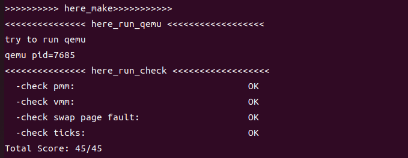

### LRU算法设计文档
***
#### 1、算法介绍
***
LRU算法又名最近最少使用算法。在本质上该算法是根据在程序执行过程中过去的页面访问历史来推测未来的行为。该算法认为过去一段时间里不曾被访问过的页面，在最近的将来可能也不会再被访问。所以，这种算法的实质是：当需要淘汰一个页面时，总是选择在最近一段时间内最久不用的页面予以淘汰。
***
#### 2、算法实现
***
**2.1 算法实现思路**

我们根据算法的实质进行算法实现。在fifo和clock实现中，我们已经使用链表来连接内存中的物理页，我们可以遍历链表来寻找最久没有使用的物理页，在物理内存缺乏的时候进行替换出去，将需要使用的物理页从交换区中交换出来。
因此根据上述分析，我们可以得知在lru算法的实现中每个物理页面都需要一个变量，用来保存该页面多久没有被使用过，该是数值越大即越久没有被使用，我们需要寻找到该值最大的页面进行swap out。
因此我们需要在Page结构体中添加成员变量Visited,表示该Page结构体距离上一次被访问经过了多少次访问。当某次访问的就是该页面时，该页面Visited值为0。

**2.2 算法具体实现**
**2.2.1 swap_manager_lru结构体**
在规范化的工程设计中，接口的标准化极为重要。ucore提供了一个通用接口以适配不同的页面置换算法，使得更换算法时仅需改变对应的结构体指针即可实现替换。在 swap_lru.c 中，定义了 swap_manager_lru 接口并关联到具体的函数，实现了针对LRU页面置换算法的接口。
代码如下：
```c++
struct swap_manager swap_manager_lru=
{
     .name            = "lru swap manager",
     .init            = &_lru_init,
     .init_mm         = &_lru_init_mm,
     .tick_event      = &_lru_tick_event,
     .map_swappable   = &_lru_map_swappable,
     .set_unswappable = &_lru_set_unswappable,
     .swap_out_victim = &_lru_swap_out_victim,
     .check_swap      = &_lru_check_swap,
};
```
**2.2.2 _lru_init_mm()**
在上述代码实现思路中，我们需要使用一个双向链表来管理内存中的物理页面，以便在需要替换页面时能够快速找到受访最少的页面。在 _lru_init_mm 函数中，我们初始化链表 pra_list_head，并将 mm->sm_priv 指向该链表的头部。这样，每个内存管理结构 mm_struct 便可通过 sm_priv 成员指向其关联的页面链表。
```c++
static int _lru_init_mm(struct mm_struct *mm)
{     
     list_init(&pra_list_head);
     mm->sm_priv = &pra_list_head;
     //全局的链表头部，用于管理 lru 页面替换算法中的页面
     return 0;
}
```

**2.2.3 _lru_check()**
在上述代码实现的思路中，我们通过得到链表中Visited值最大的物理页面，从而得到应该换出去的页面。因此我们需要对Visited值进行准确及时的更新，在该函数中我们实现该功能。
首先我们对双向链表进行遍历，对每个物理页面的页表项进行检查，如果该页面的页表项存在，并且PTE_A被设置，说明该页面最近被访问，其Visited值被设置为0；否则Visited值加1,表示距离上一次被访问时间又加1次。
通过上述操作可以将现存的物理页面链表中Visited值进行更新,判断页面是否在被上次检查过以来被访问。
代码如下：

```c++
static int _lru_check(struct mm_struct *mm){
    list_entry_t *head=(list_entry_t*) mm->sm_priv;
    assert(head != NULL);
    list_entry_t *curr_ptr=head;//
    assert(curr_ptr != NULL);

    while((curr_ptr=list_prev(curr_ptr))!=head){
        struct Page* curr_page=le2page(curr_ptr,pra_page_link);
        pte_t* tep_pte=get_pte(mm->pgdir,curr_page->pra_vaddr,0);

        if(*tep_pte & PTE_A){
            //如果页面最近被访问过（PTE_A 被设置），则将其 visited 归零，表示它被“重置”为最近访问。
            curr_page->visited=0;
            *tep_pte = *tep_pte ^ PTE_A;
        } 
        else{
            //如果页面没有被访问（PTE_A 没有被设置），则增加 visited 值，表示它被冷却了更久
            curr_page->visited++;
        }
    }
}
```

**2.2.4 _lru_swap_out_victim()**
在该函数中我们将寻找换出页面。在上述函数中我们初始化了页面队列，设置更新Visited数值的函数，因此我们可以进行寻找最久未使用的页面。
首先我们需要更新Visited数值，确定自上次检查以来的访问情况，再遍历页面双向链表，由于链表节点是list_entry_t类型，因此需要我们进行类型转换，将其转换为Page类型，从而得到Visited值。
注意，当链表为空时，我们返回-1,表明页面置换错误。
当链表不为空时，在这里我们设置list_entry_t *lru_ptr（初始化为链表尾节点），作为链表中最应该换出去的页面的节点；设置largest_visited保存最大的Visited值。遍历链表，当遇到节点对应的页面的Visited值大于largest_visited时，我们进行lru_ptr和largest_visited的替换。当遍历完全后，break，将lru_ptr对应的节点删除。将lru_ptr节点对应的Page转换为节点，保存在 *ptr_page中，函数调用者可以通过 *ptr_page 直接访问并处理要被换出的页面。

```c++
static int  _lru_swap_out_victim(struct mm_struct *mm, struct Page ** ptr_page, int in_tick)
{
    _lru_check(mm);
    list_entry_t *head=(list_entry_t*) mm->sm_priv;
    assert(head != NULL);
    assert(in_tick==0);
   
    if (list_empty(head)) {
      return -1; 
    }//避免链表为空  但是应该不会出现

    list_entry_t *curr_ptr=list_prev(head);
    list_entry_t *lru_ptr=curr_ptr;
    uint_t largest_visited=le2page(curr_ptr,pra_page_link)->visited;//得到最久没有使用的页面

    while(1){

        if(curr_ptr == head){
            break;
        }
        if(le2page(curr_ptr,pra_page_link)->visited > largest_visited){
            largest_visited=le2page(curr_ptr,pra_page_link)->visited;
            lru_ptr=curr_ptr;
            
        }
        curr_ptr=list_prev(curr_ptr);
    }
    list_del(lru_ptr);
    *ptr_page = le2page(lru_ptr, pra_page_link);
    cprintf("curr_ptr %p\n", lru_ptr);

    return 0;
}
``` 
**2.2.5 _lru_map_swappable()**
在该函数中，我们完成对物理页面插入内存物理页面链表中的操作。为了综合提升Visited更新的频率，我们在这里依旧先更新Visited的值，再使用头插法将页面插入链表中，以便下一步操作；在这里我们将页面的Visited值初始化设置为0。
```c++
static int _lru_map_swappable(struct mm_struct *mm, uintptr_t addr, struct Page *page, int swap_in)
{
    _lru_check(mm);
    list_entry_t *head=(list_entry_t*) mm->sm_priv;
    list_entry_t *entry=&(page->pra_page_link);
    assert(entry != NULL && head != NULL);
    list_add(head, entry);
    page->visited=0;

    return 0;
}
```
**2.2.6 函数调用接口**
在swap_init()函数中将指向页面置换算法结构体的指针指向lru算法中的结构体，实现接口连接。
```c++
sm = &swap_manager_lru;
```

**2.3 一些小问题**
关于_lru_check(mm);调用的频率问题。本质上我们应该定时对Visited数值进行更新，以确保未使用时间的准确性和精确性。例如在 *_lru_tick_event*函数中调用_lru_check(mm)，并且在外部调用函数，设置定时器，每隔一个时钟周期进行触发调用，确保Visited值的准确性。

#### 3、算法结果
在终端make后，运行make grade，结果如下，表明正确。

