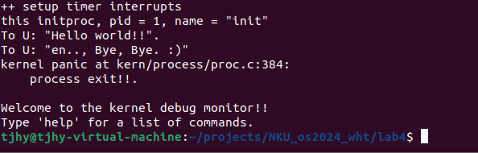

### 操作系统lab4实验报告

***

#### 成员：涂佳欢语 王婷睿 胡可玉

***

#### 练习0：填写已有实验

本实验依赖实验2/3。需要将实验2/3的代码填入本实验中代码中有“LAB2”,“LAB3”的注释相应部分。

#### 练习1：分配并初始化一个进程控制块（需要编码）

在`proc.h`中，我们定义结构体`proc_struct`，用来管理进程信息。代码如下：

```c++
struct proc_struct {
    //uCore中进程状态有四种：分别是PROC_UNINIT、PROC_SLEEPING、PROC_RUNNABLE、PROC_ZOMBIE
    enum proc_state state;                      // 进程所处的状态。
    int pid;                                    // Process ID
    int runs;                                   // the running times of Proces
    uintptr_t kstack;                           // 记录了分配给该进程/线程的内核栈的位置
    volatile bool need_resched;                 // bool value: need to be rescheduled to release CPU?
    struct proc_struct *parent;                 // 进程的父进程的指针 在内核中，只有内核创建的idle进程没有父进程
    struct mm_struct *mm;                       //保存了内存管理的信息，包括内存映射，虚存管理等内容
    struct context context;                     // 保存了进程执行的上下文（几个关键的寄存器的值）进程切换中还原之前进程的运行状态
    struct trapframe *tf;                       // 保存了进程的中断帧。当进程从用户空间跳进内核空间的时候，进程的执行状态被保存在了中断帧中
    uintptr_t cr3;                              // x86架构的特殊寄存器，用来保存页表所在的基址
    uint32_t flags;                             // Process flag
    char name[PROC_NAME_LEN + 1];               // Process name
    list_entry_t list_link;                     // 链表节点 链接入进程控制块的双向线性列表
    list_entry_t hash_link;                     // 链表节点 基于pid链接入进程控制块的哈希表
};

```

**1.1、内核控制块的分配和初始化**

在`alloc_proc`函数中，我们将分配并返回一个新的`struct proc_struct`结构，用于存储新建立的内核线程的管理信息。

因此，在`alloc_proc`函数中，我们首先通过`kmalloc`函数获得`proc_struct`结构的一块内存块，并且对其进行初步初始化。简单的初始化即把`proc_struct`中的各个成员变量清零，但由于有些成员变量拥有特殊的含义，需要设置特殊值。下面我将逐步介绍：

- *enum proc_state state:* 表示进程所处的状态，在初始化时，我们将其初始化为`PROC_UNINIT`，意味着`uninitialized`。
- *uintptr_t cr3:* 用来保存页表所在的基址。由于内核线程在内核中运行，因此`cr3`设置为uCore内核页表的起始地址`boot_cr3`。
- *int pid:* 表示进程的ID，因此我们初始化为-1，表明进程的ID还未正式生成。
  
对于其他成员变量我们将初始化为`0`或者`NULL`。在这里还需要注意`struct context context`和`char name[PROC_NAME_LEN + 1]`。

- *struct context context:* 进程上下文。其中保存了14个被调用者保存寄存器，即`ra`，`sp`，`s0~s11`共14个寄存器。因此在初始化时，我们将寄存器的值均初始化为0，即`memset(&(proc->context),0,sizeof(struct context));`。
- *char name[PROC_NAME_LEN + 1]:* 进程的名字。我们将前`PROC_NAME_LEN`个字符初始化为0，保留最后一位为`/0`。
  
因此进程控制块的分配和初始化代码如下：

```c++
    struct proc_struct *proc = kmalloc(sizeof(struct proc_struct));//通过kmalloc函数获得proc_struct结构的一块内存块
    if (proc != NULL) {
        proc->state=PROC_UNINIT;    //设置进程为“初始”态
        proc->pid=-1;               //设置进程pid的未初始化值
        proc->runs=0;
        proc->kstack=0;
        proc->need_resched=0;
        proc->parent=NULL;
        proc->mm=NULL;
        
        memset(&(proc->context),0,sizeof(struct context));//context结构体全部置为0
        proc->tf=NULL;
        
        proc->cr3=boot_cr3;     //使用内核页目录表的基址由于该内核线程在内核中运行，
                                // 故采用为uCore内核已经建立的页表，即uCore内核页表的起始地址boot_cr3
        proc->flags=0;
        memset(proc->name,0,PROC_NAME_LEN); //最后一个char存放'\0'
    }
    return proc;

```

**1.2、问题回答**

**1.2.1、struct context context:**

在ucore中，进程上下文使用结构体`struct context`保存，其中包含了`ra`，`sp`，`s0~s11`共14个寄存器。操作系统保存当前执行的进程或线程的上下文，以便将来恢复。

在`copy_thread`中：

- `proc->context.ra：`设置子进程的入口点，也就是从 `forkret` 函数开始执行。通过设置返回地址，确保当进程切换回来时，它会从 `forkret` 开始执行。
- `proc->context.sp：`设置栈指针为指向 `trapframe`，确保进程恢复执行时，从 `trapframe` 保存的状态继续执行。
  
在`switch_to`函数中，存在`context`中需要保存的寄存器进行保存和调换。

**1.2.2、struct trapframe \* tf:**

在ucore中，`trapframe` 主要用来保存进程在发生中断、系统调用、或上下文切换时的 `CPU` 状态。

在`kernel_thread`函数中，trapframe被用来设置内核线程的初始状态。

- 初始化函数指针和参数，准备内核线程的执行。
  - trapframe 中的寄存器：`tf.gpr.s0`被设置为内核线程函数的函数指针`fn`，这个函数指针会在线程启动时被调用。
  - `tf.gpr.s1`被设置为函数参数`arg`，它是传递给内核线程的参数。

- 配置状态寄存器，确保线程以内核模式启动，并禁用中断。
  - 状态寄存器`tf.status`保存进程的状态信息。表示进程运行在`Supervisor`模式，在陷阱返回时启用中断并且禁用中断，避免在内核线程执行时被中断。

- 设置程序计数器`epc`为内核线程的入口函数`kernel_thread_entry`，确保线程从正确的地方开始执行。


在`copy_thread`中，`trapframe`使子进程能够从正确的状态开始执行，且能够正确地从forkret函数恢复执行。

- 初始化子进程状态。在`fork`系统调用中，父进程的状态被复制到子进程的`trapframe`中，确保子进程继承父进程的执行上下文。
- 保存当前进程的状态
- 栈的初始化。通过设置栈指针为`trapframe`或提供的`esp`，操作系统确保进程从正确的位置恢复执行，栈空间也正确地初始化。

`context`通常与`trapframe`一起使用，以帮助操作系统管理和恢复进程状态。

#### 练习2：为新创建的内核线程分配资源（需要编码）
利用**kernel_thread**为线程的创建提供了一个接口，初始化了变量，设置了线程的上下文，但是**do_fork**是内核中负责实际创建新线程的函数，利用相关函数获得线程空间，内核栈等等。
**2.1 代码实现**
```c++
int
do_fork(uint32_t clone_flags, uintptr_t stack, struct trapframe *tf) {
    int ret = -E_NO_FREE_PROC;
    struct proc_struct *proc;
    if (nr_process >= MAX_PROCESS) {
        goto fork_out;
    }
    ret = -E_NO_MEM;

    // 1. 调用 alloc_proc 分配一个 proc_struct
    if ((proc = alloc_proc()) == NULL) 
    {
        goto fork_out;
    }
    // 2. 调用 setup_kstack 为子进程分配一个内核栈
    if ((setup_kstack(proc)) == -E_NO_MEM)
    {
        goto bad_fork_cleanup_kstack;
    }
    // 3. 根据 clone_flag 调用 copy_mm 复制或共享 mm
    if(copy_mm(clone_flags, proc)!=0)
    {
        goto bad_fork_cleanup_proc;
    }
    // 4. 调用 copy_thread 设置 proc_struct 中的 tf 和上下文
    copy_thread(proc,stack,tf);
    proc->parent = current;

    // 5. 将 proc_struct 插入到 hash_list 和 proc_list 中
    bool intr_flag;
    local_intr_save(intr_flag);
    {
        proc->pid = get_pid();
        hash_proc(proc);
        list_add(&proc_list, &(proc->list_link));
        nr_process ++;
    }
    local_intr_restore(intr_flag);
    // 6. 调用 wakeup_proc 使新子进程变为可运行状态 (RUNNABLE)
    wakeup_proc(proc);
    // 7. 使用子进程的 pid 设置返回值
    ret = proc->pid; 


// 函数的返回点
fork_out:
    return ret;
// 在分配内核栈失败时，释放已经分配的栈
bad_fork_cleanup_kstack:
    put_kstack(proc);
// 在进程分配失败时或其他错误发生时，释放已分配的进程结构体内存。    
bad_fork_cleanup_proc:
    kfree(proc);
    goto fork_out;
}
```

1. 首先调用的**alloc_proc()**来为一个新进程或内核线程分配内存并初始化相关字段。如果分配失败（返回 NULL），就跳转到fork_out 进行清理。
2. 调用**setup_kstack()函数**为子进程分配内核栈.在函数中又调用了**alloc_pages（）函数**为进程分配KSTACKPAGE（2）个物理页面，分配完成将分配的物理地址转换为虚拟地址赋值进程的kstack成员（用于记录内核栈的位置）。
```c++
// setup_kstack - 为进程分配大小为 KSTACKPAGE 的内核栈页面
static int
setup_kstack(struct proc_struct *proc) {
    // 分配大小为 KSTACKPAGE 的内存页
    struct Page *page = alloc_pages(KSTACKPAGE);  

    if (page != NULL) {
        // 将内存页的物理地址转换为内核虚拟地址并存储到 proc->kstack
        proc->kstack = (uintptr_t)page2kva(page);
        return 0;
    }
    return -E_NO_MEM;
}
```
3. 通过**copy_mm()**复制或共享父进程的内存管理信息。但在本次实验中copy_mm()什么都不做，之后的实验中会实现。在本次使用中创建第一个内核线程（initproc）采用的是共享。
```c++
static int
copy_mm(uint32_t clone_flags, struct proc_struct *proc) {
    assert(current->mm == NULL);
    /* do nothing in this project */
    return 0;
}
```
4. 调用**copy_thread()**来为进程设置上下文（tf和context）。再将本进程的父节点设置为目前在运行的进程，构建出一个进程树来进行管理和调度进程。
```c++
static void
copy_thread(struct proc_struct *proc, uintptr_t esp, struct trapframe *tf) {
    // 设置进程的 trapframe 指针，指向进程内核栈顶部，留出 trapframe 的空间
    proc->tf = (struct trapframe *)(proc->kstack + KSTACKSIZE - sizeof(struct trapframe));
    // 将传入的 tf（父进程或线程的状态信息） 数据拷贝到进程的 trapframe 中
    *(proc->tf) = *tf;

    // 将 a0 寄存器设置为 0，说明这个进程是一个子进程
    proc->tf->gpr.a0 = 0;
    // 设置子进程的栈指针 (sp)
    // 如果 esp 为 0，则将 sp 设置为 trapframe 的地址，表示从内核栈顶部开始；否则使用传入的 esp 值
    proc->tf->gpr.sp = (esp == 0) ? (uintptr_t)proc->tf : esp;

    // 设置返回地址寄存器 (ra)，当内核线程从内核模式返回时会跳转到 forkret
    proc->context.ra = (uintptr_t)forkret;
    // 设置内核上下文中的栈指针 (sp)，指向 trapframe 的地址
    proc->context.sp = (uintptr_t)(proc->tf);
}
```
5. 将进程插入到hash和proc的链表中，在插入前禁用中断，结束后再恢复中断。
```c++
bool intr_flag;
    local_intr_save(intr_flag);
    {
        proc->pid = get_pid();
        hash_proc(proc);
        list_add(&proc_list, &(proc->list_link));
        nr_process ++;
    }
    local_intr_restore(intr_flag);
```
- **local_intr_save()函数**用于保存当前的中断状态，**local_intr_restore（）函数**用于恢复中断状态。  
- get_pid()函数给该进程分配唯一的id
```c++
static int
get_pid(void) {
    static_assert(MAX_PID > MAX_PROCESS);
    struct proc_struct *proc;
    list_entry_t *list = &proc_list, *le;  //list 指向进程链表的头部（proc_list），le 用于遍历链表中的每个元素
    static int next_safe = MAX_PID, last_pid = MAX_PID;
    //next_safe：表示下一个可用的安全 PID  last_pid：上次分配的 PID
    //如果超出 MAX_PID，重新从 1 开始分配
    if (++ last_pid >= MAX_PID) {
        last_pid = 1;
        goto inside;
    }
    //当前 PID 超出或达到 next_safe，可能存在冲突
    if (last_pid >= next_safe) {
    inside:
        next_safe = MAX_PID;
    repeat:
        le = list;
        //逐一检查进程块编号
        while ((le = list_next(le)) != list) {
            proc = le2proc(le, list_link);
            // 当前 last_pid 已被占用
            if (proc->pid == last_pid) {
                //递增后超出next_safe 或 MAX_PID，重新循环查找
                if (++ last_pid >= next_safe) {
                    if (last_pid >= MAX_PID) {
                        last_pid = 1;
                    }
                    next_safe = MAX_PID;
                    goto repeat;
                }
            }
            //更新 next_safe 为最小的占用 PID，避免分配冲突
            else if (proc->pid > last_pid && next_safe > proc->pid) {
                next_safe = proc->pid;
            }
        }
    }
    return last_pid;
}
```
- hash_proc（）函数是将pid进行hash运算后，得到pid所在桶的位置，将该进程或者线程的hash_link，加入到该桶的位置。
```c++
static void
hash_proc(struct proc_struct *proc) {
    list_add(hash_list + pid_hashfn(proc->pid), &(proc->hash_link));
}
```
- 再将本进程加入到进程链表链接中，最后给当前的进程数加1

6. 之后将设置好的进程设置为可运行状态，返回pid的值。
7. 函数的最后还写了出错的解决方案：
```c++  
// 函数的返回点
fork_out:
    return ret;
// 在分配内核栈失败时，释放已经分配的栈
bad_fork_cleanup_kstack:
    put_kstack(proc);
// 在进程分配失败时或其他错误发生时，释放已分配的进程结构体内存。    
bad_fork_cleanup_proc:
    kfree(proc);
    goto fork_out;
```

**2.2 回答问题**  

问：请说明ucore是否做到给每个新fork的线程一个唯一的id？请说明你的分析和理由
答：可以。因为在`do_fork函数`中，我们就调用了`get_pid函数`为该线程或者进程分配了唯一的pid，而且在`proc.h`中也定义了`MAX_PID=MAX_PROCESS * 2`，有足够大小的pid来分配。


#### 练习3：编写proc_run 函数（需要编码）

proc_run用于将指定的进程切换到CPU上运行，它的大致执行步骤包括：

1.检查要切换的进程是否与当前正在运行的进程相同，如果相同则不需要切换。

2.禁用中断。

3.切换当前进程为要运行的进程；切换页表，以便使用新进程的地址空间；切换上下文。

4.允许中断。

根据它的执行步骤，填写代码如下：

```c++
void
proc_run(struct proc_struct *proc) {
    if (proc != current) {  // 如果待运行的进程不是当前进程
        bool intr_flag; // 保存是否启用中断
        struct proc_struct *prev = current, *next = proc;
        local_intr_save(intr_flag); // 禁用中断，确保操作的原子性
        {
            current = proc;
            lcr3(proc->cr3); // 切换页表，以便使用新进程的地址空间
            switch_to(&(prev->context), &(next->context)); // 实现上下文切换
        }
        local_intr_restore(intr_flag); // 启用中断
       
    }
}
```

对实现代码进行说明：

- `if (proc != current)` 检查目标进程 `proc` 是否与当前正在运行的进程（`current`）相同。如果相同，意味着当前进程已经在运行，不需要进行切换，所以可以直接返回。只有在目标进程与当前进程不同的情况下，才会执行接下来的操作。 `current` 表示当前正在执行的进程。

- `bool intr_flag;` 声明一个 `bool` 类型的变量 `intr_flag`，用于保存当前中断的状态，在禁用中断之前先将当前的中断状态保存下来，以便稍后恢复，由于只有开、关两种情况，所以使用`bool` 类型。

-  `struct proc_struct *prev = current, *next = proc;` 声明两个进程指针 `prev` 和 `next`，分别指向当前进程和目标进程。

- 调用 `local_intr_save(intr_flag)` 宏来禁用中断并保存当前中断状态，保证进程切换操作的原子性。

-  `current = proc;` 将当前进程切换为要运行的进程。

- 调用 `lcr3(proc->cr3)` 来切换页表，cr3寄存器是x86架构的特殊寄存器，用来保存页表所在的基址， `proc->cr3` 是目标进程的页表基地址。

-  `switch_to(&(prev->context), &(next->context));` 调用 `switch_to()` 函数，执行上下文切换， `prev->context` 和 `next->context` 分别是当前进程和要运行的进程的上下文。

- 调用 `local_intr_restore(intr_flag)` 恢复中断状态。

回答问题：在本实验的执行过程中，创建且运行了几个内核线程？

在本实验中创建并运行了两个内核线程：第0个线程idleproc和第1个线程initproc。

与本实验相关的部分运行结果截图：



#### 扩展练习 Challenge

- 说明语句local_intr_save(intr_flag);....local_intr_restore(intr_flag);是如何实现开关中断的？
- `local_intr_save(intr_flag)`和`local_intr_restore(intr_flag)`是在`sync.h`里定义的两个用来在局部范围内保存和恢复中断状态的函数。在函数的实现中，又分别调用了`__intr_save`和`__intr_restore`两个内联函数。`local_intr_save(intr_flag)`得到__intr_save（）的返回值，如果返回值为1，表示需要恢复中断；如果中断已禁用，返回值会为 0，表示无需恢复中断。`local_intr_restore(intr_flag)`调用__intr_restore()，传入 x 参数，恢复中断状态。如果 x 为 1，则恢复中断；如果 x 为 0，则不做任何操作。
```c++
static inline bool __intr_save(void) {
if (read_csr(sstatus) & SSTATUS_SIE) //检查当前的SIE位，
{
    //如果启用了全局中断（SIE为1），禁用中断并返回 1；否则返回 0。
    intr_disable();
    return 1;
}
return 0;
}
```

```c++
static inline void __intr_restore(bool flag) {
    if (flag)   //根据传入的flag恢复中断状态
    {
        // 如果 flag 为 1，说明之前中断已被禁用，因此需要重新启用中断
        intr_enable();
    }
}
```

